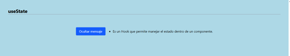
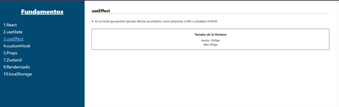
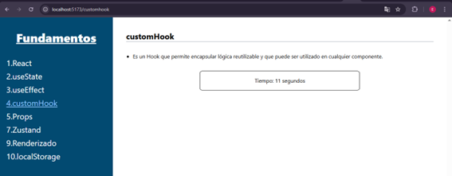
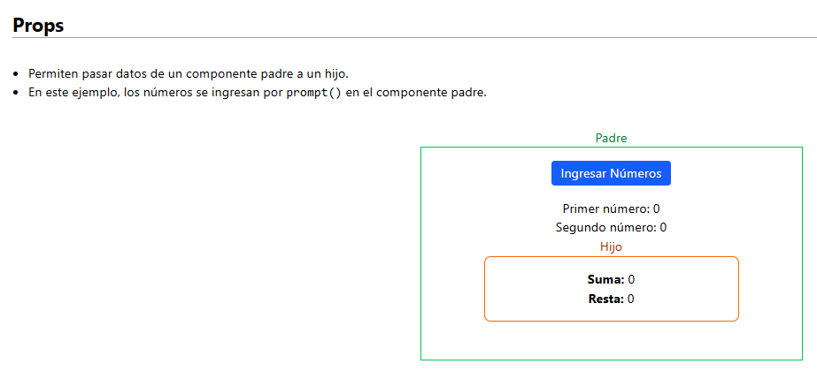
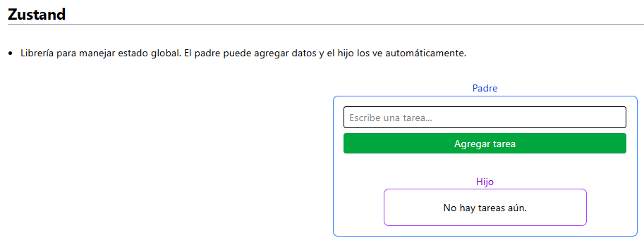
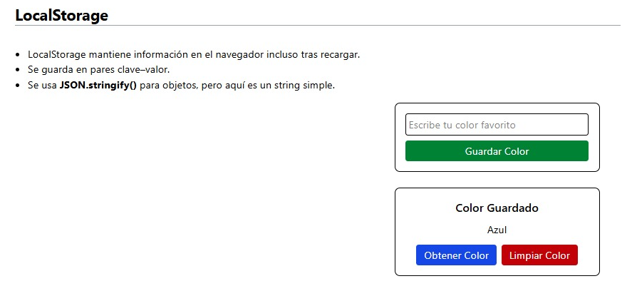

<h1 align="center"> ⚛️FUNDAMENTOS DE REACT ⚛️</h1>

Se desarrollaron ejemplos con los diferentes conceptos clave aprendidos en clase. Con su ayuda fue posible identificar la influencia que tienen en el desarrollo de aplicaciones más interactivas.

## 🛠️ Creado por

Este proyecto fue completado por las siguientes integrantes:

- Nayely Ayol
- Alessia Pérez
- Emily Galeas

## 🖼️ Vista Previa del Proyecto

| **Función** | **Ejemplo** | **Descripción** |
| :----------- | :-----------: | :---------------------------------------------- |
| **React** |  | Librería para construir interfaces de usuario dinámicas con componentes reutilizables. |
| **useState** |  | La memoria del componente. Guarda un valor y fuerza la actualización (renderizado) al cambiar. |
| **useEffect** |  | Permite ejecutar tareas externas (ej. llamadas a API) después del renderizado. |
| **customHook** |  | Función personalizada para reutilizar lógica compleja de estado (useState, useEffect) entre varios componentes. |
| **Props** |  | Datos de solo lectura pasados de un componente padre a un hijo para configurarlo. |
| **Zustand** |  | Librería que crea un almacén de datos central (estado global) para compartir información sin pasar props. |
| **Renderizado** |  | Proceso que actualiza la pantalla para mostrar los cambios en los datos “en vivo”. |
| **localStorage** |  | API del navegador que guarda datos de forma persistente en el dispositivo del usuario. |

## 🔗 Link del despliegue en Netlify

